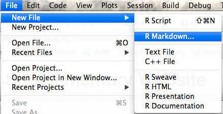

---
output:
  knitrBootstrap::bootstrap_document:
    theme.chooser: TRUE
    highlight.chooser: TRUE
  html_document:
    toc: true
    theme: spacelab
---

Repositories at `leekgroup`
==========================


```{r bibsetup, echo=FALSE, message=FALSE, warning=FALSE}
## Load knitcitations with a clean bibliography
library('knitcitations')
cleanbib()
cite_options(hyperlink = 'to.doc', citation_format = 'text', style = 'html')

bibs <- c('knitcitations' = citation('knitcitations'),
    'derfinder' = citation('derfinder')[1],
    R = citation()
)
write.bibtex(bibs, file = 'leekgroupRepos.bib')
bib <- read.bibtex('leekgroupRepos.bib')
names(bib) <- names(bibs)
```

This protocol template was contributed by [L. Collado-Torres](http://bit.ly/LColladoTorres).


# Overview


This protocol is about creating repositories under the `leekgroup` organization account that [Jeff](http://jtleek.com/) setup. This summer there are a few interns at `leekgroup` and they motivated me to write this protocol.


# Introduction


Recently [Jeff](http://jtleek.com/) created a GitHub organization account called [leekgroup](https://github.com/leekgroup). The goal is to have all the code that is created at the Leek Group saved there. It is a great way to organize all our code and make it easy for us and others to find what everyone at Leek Group is doing. 

I believe that another strong reason is that having our code in an organization account means that [Jeff](http://jtleek.com/) ultimately retains some control over the repositories. Previously, with our code hosted in our accounts, accidents could happen where someone deletes a repository with code [Jeff](http://jtleek.com/) would like preserved, among other bad scenarios.

There is a disadvantage to `leekgroup`, which I believe is minor. 

## Private vs public

At `leekgroup` there are no private repositories. This means that all your code is public. With personal accounts, if you have an email account from an educational institution, you can apply for the [student developer pack](https://education.github.com/) which gives you 5 free private repositories, which would otherwise be $7 a month at the time of writing this procotol. In the past, I have used private repositories for version controlling code from projects that are in development. Arguments against this position are (1) that you should write your commit history assuming others will read it, and (2) that you should fear people not paying attention to your work instead of the opposite (I'm paraphrasing [Matthew Stephens](http://genes.uchicago.edu/contents/faculty/stephens-matthew.html) in the second argument). Nowadays I'm in favor of having all code public and I think that potential employers in both industry and academia will love to see your code history. `leekgroup` could have private repositories, but [Jeff](http://jtleek.com/) would have to pay a monthly fee which seems unnecessary. 

Note that if you really want lots of private repositories, [Bitbucket](https://bitbucket.org/plans) gives free unlimited private repositories if you use an academic email and your academic institution is in their list (otherwise apply to get it added). If you do use private repositories, I recommend making the repository public once your project is published. If you plan on doing so, make sure your commit history is written in a way that you wouldn't mind sharing it with others.

If you are concerned about having your code public, talk about it with [Jeff](http://jtleek.com/). Just remember that there are many advantages to having your code public and keeping everything organized.

# A repo at `leekgroup`

First, [Jeff](http://jtleek.com/) has to add you to `leekgroup`. If he hasn't yet, email him your GitHub account username.

## Transfer one

Lets say that you already have a repository at GitHub called `my_repo`. If you have it at Bitbucket, then check [adding a remote](https://help.github.com/articles/adding-a-remote/). 

What you basically need to do is transfer ownership of your repository to the `leekgroup` account. The website [transferring a repository](https://help.github.com/articles/transferring-a-repository/) describes this process in detail. That you should update the URL for the `origin` remote (described at the end of the previous link).


## Create one

If you are starting a project from scratch, you simply have to open [github.com/leekgroup](https://github.com/leekgroup), log into your account, and click on "new repository". Then follow the instructions from [create a repo](https://help.github.com/articles/create-a-repo/). Once it's created, you can clone it to your computer to have a local version where you can work on it.


# Perform an analysis

Most of the repositories at `leekgroup` either have code that allow you to reproduce a specific analysis or host the code for a software tool such as an `R` package. I'll cover some basics of a repository that has analysis code written in `R`.

## gh-pages setup

You can obviously organize your analysis code however you want. But given that you are hosting your code in GitHub, you might as well take advantage of [GitHub Pages](https://pages.github.com/). Basically, HTML content from your `gh-pages` branch at `my_repo` will be publicly viewable at `http://leekgroup.github.io/my_repo/`. For example, the code from the project [derSoftware](https://github.com/leekgroup/derSoftware) is available [here](http://leekgroup.github.io/derSoftware/). The `derSoftware` repository has the supplementary material for the `derfinder` paper `r citep(bib[['derfinder']])`. Note how the only branch is `gh-pages`. 

When you create a repository at GitHub, the default branch is called `master`. If you only want a `gh-pages` branch, you first have to create it. You can create it locally with the code shown below or at Github following [creating and deleting branches within your repository](https://help.github.com/articles/creating-and-deleting-branches-within-your-repository/).

```bash
## Access your repo locally
$ cd my_repo

## Create the gh-pages branch
$ git checkout -b gh-pages

## Push it to GitHub (origin remote by default)
$ git push -u origin gh-pages
```

Next, I recommend deleting the `master` branch to minimize confusion unless you are proficient with handling multiple branches. Follow the instruction from the previous link.

If you want to have multiple branches, you can set `gh-pages` to be the default one by following the instructions [here](https://help.github.com/articles/setting-the-default-branch/).

For more info, check the basics about [git branching and merging](https://git-scm.com/book/en/v2/Git-Branching-Basic-Branching-and-Merging).

## Sync with Slack

I like the feature in Slack that allows you to get notifications from changes in your GitHub repository at a specific channel. For that to work, you need to [set up the GitHub integration](https://slack.zendesk.com/hc/en-us/articles/201824286-Setting-up-the-GitHub-integration). Then, you'll see a message in Slack whenever someone makes a commit, submits a pull request, writes a comment, etc. It's a great feature and an easy way to keep everyone in your Slack channel updated about your progress.

## Create index

The first thing you should do is create an `index.html` file along with the empty `.nojekyll` file. The `.nojekyll` file is necessary to tell GitHub not to run [Jekyll](http://jekyllrb.com/). As for the `index.html` file, you could write the HTML yourself or use [R Markdown](http://rmarkdown.rstudio.com/). Check the section about R Markdown in [how to submit a new protocol](../submit_protocol/) to learn about it. That is, create a `index.Rmd` file that generates HTML output. The easiest way to do so is via [RStudio](http://www.rstudio.com/). Open RStudio and open "File -> New File -> R Markdown":

<center></center>

Then choose HTML document as the output as shown below.

<center></center>

Then simply modify the content, save the file as `index.Rmd`, and render the HTML document `index.html`. Add both of them to the git repository as well as the empty `.nojekyll` file ("git add") and push them to GitHub. Your project index should be live soon.

Keep updating it so members of `leekgroup` know where to find the latest results you've created. Alternatively, your index could simply refer viewers to the `README.md` file of your repository. 

## Create analysis steps

Instead of having a huge document that runs all the steps of your analysis, I recommend breaking it up into small parts. I save each step in its own directory as you can see in the [derSoftware](https://github.com/leekgroup/derSoftware) repository. I then add a link to each of the steps in my index file.

Inside each analysis step, you could save the script as `index.Rmd`, but I prefer to name them after the actual step I'm performing. Just remember that you have to include the file name in your links if you do so. See for example [lcolladotor.github.io/derSoftware/timing/timing.html](http://lcolladotor.github.io/derSoftware/timing/timing.html) where I called both the analysis step directory `timing` and the script `timing.Rmd` which generated `timing.html`.

## Miscellaneous

As general practice, it's best if you include comments about what you are observing in the plots / tables you create. This might mean that you'll have to run the analysis twice. Once to create the results, and another one to include your interpretations. However, if the analysis step takes too long, consider writing it as a simple `R` script, and then using `R Markdown` for loading the results and making the plots.


If you are saving your progress in HTML files, then take a peak at some features that could make your reports interactive, such as interactive tables. Enjoy!


# References


Citations made with `knitcitations` `r citep(bib[['knitcitations']])`.


```{r 'bibliography', results='asis', echo=FALSE, cache=FALSE}
## Print bibliography
bibliography()
```

```{r 'cleanupBib', echo = FALSE, results = 'hide'}
## Clean up
file.remove('leekgroupRepos.bib')
```

Date this protocol was last modified: `r Sys.time()`.
