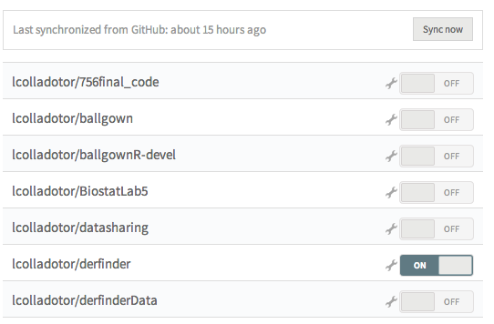

---
output:
  knitrBootstrap::bootstrap_document:
    theme.chooser: TRUE
    highlight.chooser: TRUE
  html_document:
    toc: true
    theme: united
---

Routinely testing your R package with Travis
============================================


```{r bibsetup, echo=FALSE, message=FALSE, warning=FALSE}
## Load knitcitations with a clean bibliography
library('knitcitations')
cleanbib()
cite_options(hyperlink = 'to.doc', citation_format = 'text', style = 'html')

bibs <- c('knitcitations' = citation('knitcitations'),
    R = citation(),
    bioc = citation('Biobase'),
    devtools = citation('devtools')
)
write.bibtex(bibs, file = 'NewPostRefs.bib')
bib <- read.bibtex('NewPostRefs.bib')
names(bib) <- names(bibs)
```

This protocol was contributed by [L. Collado-Torres](http://bit.ly/LColladoTorres).


# Overview

At some point after in the `R` `r citep(bib[['R']])` learning curve you get to a level where you want to write your own functions. The next step is to share the functions in the form of an `R` package. The Leek group way of doing so is described in more detail [here](https://github.com/jtleek/rpackages) `r citep('https://github.com/jtleek/rpackages')`.

Sharing your functions as an `R` package means that others can easily use them after installing the package. This all sounds great until you then realize that there is some responsibility on your side to make sure things are working properly. `R` has a command to help you do so, namely _R CMD check_ which verifies that everything is in order. 

Projects like [Bioconductor](http://www.bioconductor.org/) `r citep(bib[['bioc']])` help both the developer and the user community by running _R CMD check_ on their packages every day. Doing so helps identify any issues your functions might have because something else changed (like a function you imported). Bioconductor runs other tests and demands that a package satisfies specific criteria to be included in the project, but the idea of routinely checking your `R` package remains.

In recent years, more and more developers have turned towards hosting their packages in [GitHub](https://github.com/), specially in the development phase even when working with [CRAN](http://cran.r-project.org/) or Bioconductor (through a [git-svn bridge](http://www.bioconductor.org/developers/how-to/git-svn/)). While as a developer you can test your package locally, at some point it starts to take a large chunk of your time. That's where open source tools like [Travis CI](https://travis-ci.org/) make your life as a developer easier. You can basically set Travis CI to run _R CMD check_ for you every time you push code to GitHub. This protocol explains how to setup Travis CI.

# Setting up Travis

To start, we will assume that you have a GitHub account with at least one repository that contains an `R` package, lets call it _rpack_. Your very first step is to sign in to Travis using your GitHub account at [travis-ci.org/](https://travis-ci.org/).

## Basic setup

### Flip the switch

Once Travis gets your list of GitHub repositories (force a sync if you don't see _rpack_), you can turn on Travis for _rpack_ by flipping the switch at [travis-ci.org/profile](https://travis-ci.org/profile). For example, here we turned on the switch for _derfinder_:

<center></center>

### Setup via devtools

If you are using `devtools` `r citep(bib[['devtools']])` for developing your package, you can simply add Travis to `rpack` by using

```{r devtools, eval = FALSE}
library('devtools')
use_travis('path to rpack')
```

This will create the __.travis.yml__ and __.Rbuildignore__ files in _rpack_'s main directory.


### Manual basic setup

#### Add .travis.yml

The next step is to add the file __.travis.yml__ to your repository (in the main directory). This file will specify your Travis configuration such as which `R` packages to install, when you want to be notified by Travis, and what information you want to see.

The easiest way to setup Travis for R projects is to use [r-travis](https://github.com/craigcitro/r-travis) `r citep('https://github.com/craigcitro/r-travis')`. [r-travis instructions](https://github.com/craigcitro/r-travis/wiki) show how to add __.travis.yml__ with commands, but basically, you want to start by copying the example configuration file shown below into your __.travis.yml__ file:

```
# Sample .travis.yml for R projects.
#
# See README.md for instructions, or for more configuration options,
# see the wiki:
#   https://github.com/craigcitro/r-travis/wiki

language: c

before_install:
  - curl -OL http://raw.github.com/craigcitro/r-travis/master/scripts/travis-tool.sh
  - chmod 755 ./travis-tool.sh
  - ./travis-tool.sh bootstrap
install:
  - ./travis-tool.sh install_deps
script: ./travis-tool.sh run_tests

after_failure:
  - ./travis-tool.sh dump_logs

notifications:
  email:
    on_success: change
    on_failure: change
```

(Check [here](https://github.com/craigcitro/r-travis/raw/master/sample.travis.yml) for the latest version of this example configuration.)

#### Ignore .travis.yml

Once you added the __.travis.yml__ file you are nearly done with the initial setup. Next, you have to tell `R` to ignore this specific file. You can do so using the hidden file __.Rbuildignore__ which should look like this:

```
## Ignore travis config file
^\.travis\.yml$
```

### Add them to git

The last step in the basic setup is to simply ask Git to version control the __.travis.yml__ and __.Rbuildignore__ files. That is, use _git add_ or the add button if you are using a Git/GitHub GUI.

```
git add .travis.yml .Rbuildignore
git commit -m 'enable continuous integration via craigcitro/r-travis'
git push
```

Then, push the files to GitHub. This will prompt Travis to check your package using the basic configuration file.

### Add a status image

If you want users to quickly check whether your package is passing the tests run on Travis, simply add a status image. Doing so is quite strait forward and explained in more detail [here](http://docs.travis-ci.com/user/status-images/).

## Configuring .travis.yml

### Installing required packages

On a simple scenario, you only have to use the basic setup. In a more realistic scenario, your package might depend on other packages which are available either through CRAN, Bioconductor or GitHub. If that's the case, [r-travis](https://github.com/craigcitro/r-travis) has commands which allow you to install these dependencies before installing _rpack_.

These are:

```
install:
  ## For a CRAN package
  - ./travis-tool.sh install_r <package>
  
  ## For a Bioconductor package
  - ./travis-tool.sh install_bioc <package>
  
  ## For a GitHub package
  - ./travis-tool.sh install_github <package>
```

These can be useful if you want to install the packages in a specific order. However, you might prefer to use commands that look up _rpack_'s DESCRIPTION file and automatically determine the list of packages to install.

```
install:
  ## For installing all CRAN dependencies using rpack's DESCRIPTION
  - ./travis-tool.sh install_deps
  
  ## For installing all Bioconductor dependencies using rpack's DESCRIPTION
  - ./travis-tool.sh install_bioc_deps
```

Any of these commands have to be specified under the `install` step. For example

```
install:
  - ./travis-tool.sh install_github hadley/devtools
  - ./travis-tool.sh install_bioc_deps
```

Note that if you are installing Bioconductor packages, there are two versions you could be using. The current _release_ or the current _devel_ version. By default, [r-travis](https://github.com/craigcitro/r-travis) uses the current _devel_ version of the packages, but you can turn this off by specifying in __.travis.yml__ the `BIOC_USE_DEVEL` environment variable:

```
env:
  global:
    - BIOC_USE_DEVEL="FALSE"
```

Further configuration details are explained in the [r-travis wiki](https://github.com/craigcitro/r-travis/wiki). You might also be interested in checking the [travis-examples](https://github.com/csgillespie/travis-examples) repository.

### Configuring _R CMD check_

By default [r-travis](https://github.com/craigcitro/r-travis) will skip the step of building the vignette and the manual in _R CMD build_ and _R CMD check_. For checking, it will also test as it was for CRAN. More specifically, the default options are:

```bash
R CMD build --no-build-vignettes --no-manual rpack
R CMD check --no-build-vignettes --no-manual --as-cran rpack
```

In your case, you might want to use a different set of options to build and/or check your package. For example, you might be interested in getting the timing information for the examples for all of your functions. You can do so by setting the environment variable `_R_CHECK_TIMINGS_` to `0`. 

That is, using the following in your __.travis.yml__

```
env:
  global:
    - R_CHECK_ARGS="--no-build-vignettes --no-manual --timings"
    - _R_CHECK_TIMINGS_="0"
```


`_R_CHECK_TIMINGS_` and other options are described in more detail at the [R Internals](http://cran.r-project.org/doc/manuals/r-release/R-ints.html#Tools) manual.


### Configuring the report

Checking for how much time was spent in each of the example pages is great (see above), but by default this information is not reported on Travis. To get the timing information you need to configure Travis to dump the data in the report.

Similarly, you might want Travis to report the versions of the `R` packages used in the test. To achieve both goals, add the following to your __.travis.yml__ file:

```
after_script:
  - ./travis-tool.sh dump_logs_by_extension "timings"
  - ./travis-tool.sh dump_sysinfo
```

### derfinder use case

As a complicated use case, we present the __.travis.yml__ file for the [derfinder](https://github.com/lcolladotor/derfinder) package. 

`derfinder` depends on two other packages that are available via GitHub: `derfinderHelper` and `derfinderData`. Thus, they need to be installed before `derfinder` can be installed. However, those two packages have some dependencies themselves such as `knitr` and `rmarkdown`, so they have to be installed first.

Furthermore, `derfinder` runs its tests only then the environment variable `R_CHECK_TESTS` is set to `TRUE` (details [here](https://github.com/lcolladotor/derfinder/blob/master/tests/test-all.R)). Finally, the results from the Travis tests are reported to [Slack](https://slack.com/): for details check the Slack-Travis integration site. 

```
language: c

before_install:
#  - curl -OL http://raw.github.com/craigcitro/r-travis/master/scripts/travis-tool.sh
  - curl -OL http://raw.github.com/lcolladotor/r-travis/master/scripts/travis-tool.sh
  - chmod 755 ./travis-tool.sh
  - ./travis-tool.sh bootstrap
 
install:
  - ./travis-tool.sh install_bioc S4Vectors
  - ./travis-tool.sh install_bioc IRanges
  - ./travis-tool.sh install_r Matrix
  - ./travis-tool.sh install_r knitr
  - ./travis-tool.sh install_r rmarkdown
  - ./travis-tool.sh install_r knitcitations
  - ./travis-tool.sh install_r knitrBootstrap
  - ./travis-tool.sh install_github lcolladotor/derfinderHelper
  - ./travis-tool.sh install_github lcolladotor/derfinderData
  - ./travis-tool.sh install_bioc_deps
 
script: ./travis-tool.sh run_tests

on_failure:
  - ./travis-tool.sh dump_logs

after_script:
  - ./travis-tool.sh dump_logs_by_extension "timings"
  - ./travis-tool.sh dump_sysinfo

notifications:
  email:
    on_success: change
    on_failure: change
  slack:
    secure: FIA40TI4UkOHvR19rNCfX1la5tiCmyEMjiO/sGyK0cWGt5qQxIOp+PHE3pOk9axYiVacbSCR3oAosQUsOxRew/6FyMsNR3bCPXVUzrIimABvBbjofMBDx3Z7W03O+6YahmHwDrJEWDuJ0k4457QqeqhITcFWX4twieo5fJCjedI=

env:
  global:
    - R_BUILD_ARGS="--no-build-vignettes --no-manual --no-resave-data"
    - R_CHECK_ARGS="--no-build-vignettes --no-manual --timings"
    - R_CHECK_TIME="TRUE"
    - R_CHECK_TESTS="TRUE"
    - _R_CHECK_TIMINGS_="0"
```

(The latest version can be seen live [here](https://github.com/lcolladotor/derfinder/blob/master/.travis.yml))

### Learn more

If you already browsed the [r-travis wiki](https://github.com/craigcitro/r-travis/wiki) the next best place is to actually look at [travis-tool.sh](https://github.com/craigcitro/r-travis/blob/master/scripts/travis-tool.sh). This is the main script that runs r-travis.


# References

We first heard about Travis CI integration with R from [Yihui Xie](http://yihui.name/en/about/) on his blog post [Travis CI for R?](http://yihui.name/en/2013/04/travis-ci-for-r/) and it's follow up post [Travis CI for R? (not yet)](http://yihui.name/en/2013/04/travis-ci-general-purpose/). However, it only became easy to install thanks to the [r-travis](https://github.com/craigcitro/r-travis) project and with [@siddharthab](https://github.com/siddharthab)'s contributions to support Bioconductor packages. Plus a helpful reminder to take a look at Travis CI:

<blockquote class="twitter-tweet" lang="en"><p>Are you building packages for <a href="https://twitter.com/hashtag/rstats?src=hash">#rstats</a>, using <a href="https://twitter.com/github">@github</a>, and not using <a href="https://twitter.com/travisci">@travisci</a>? Stop and look at devtools::add_travis now.</p>&mdash; John Muschelli (@StrictlyStat) <a href="https://twitter.com/StrictlyStat/status/510134625705160704">September 11, 2014</a></blockquote>
<script async src="//platform.twitter.com/widgets.js" charset="utf-8"></script>


Citations made with `knitcitations` `r citep(bib[['knitcitations']])`.


```{r bibliography, results='asis', echo=FALSE, cache=FALSE}
## Print bibliography
bibliography()
```

```{r 'cleanupBib', echo = FALSE, results = 'hide'}
## Clean up
file.remove('NewPostRefs.bib')
```

Date this protocol was last rendered:

```{r date, echo = FALSE}
## date
Sys.time()
```

